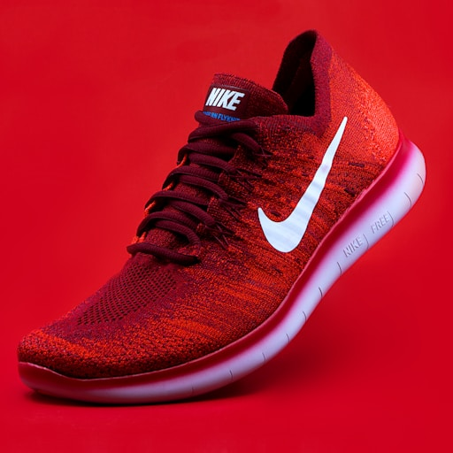
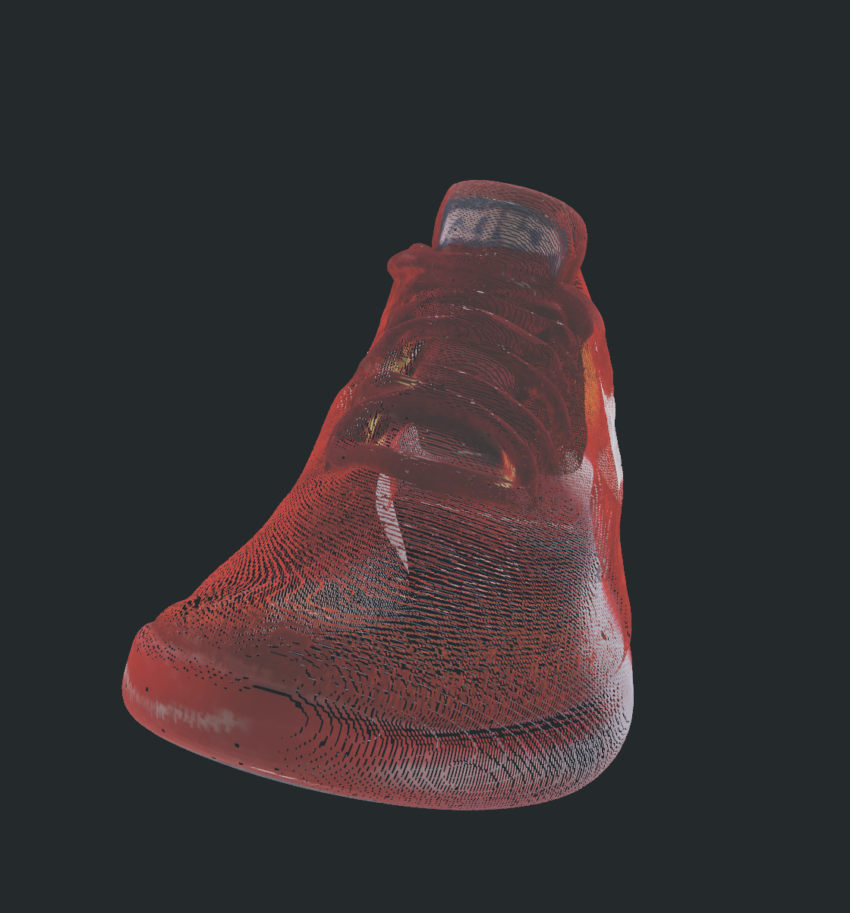
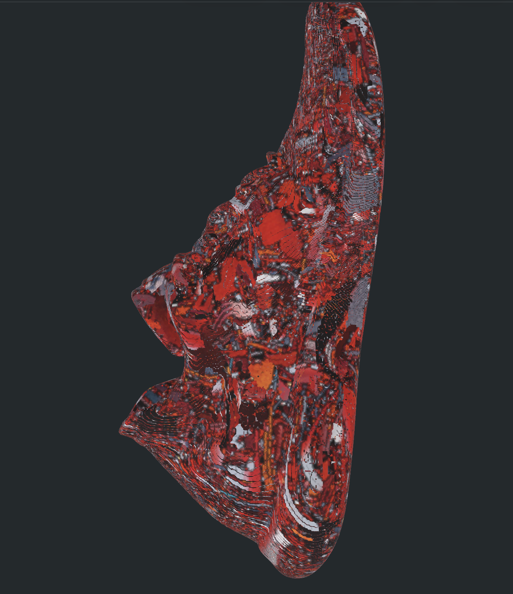
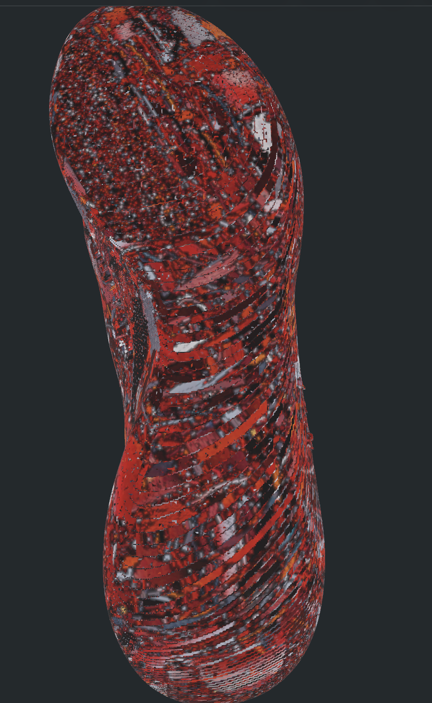

# TRELLIS.2 for Apple Silicon

Run [TRELLIS.2](https://github.com/microsoft/TRELLIS) image-to-3D generation natively on Mac.

This is a port of Microsoft's TRELLIS.2 — a state-of-the-art image-to-3D model — from CUDA-only to Apple Silicon via PyTorch MPS. No NVIDIA GPU required.

## Results

Generates **400K+ vertex meshes** from single images in **~3.5 minutes on M4 Pro**.

Output includes textured OBJ and GLB files with PBR materials, ready for use in 3D applications.

### Example: Nike shoe (single photo → 3D mesh)

**Input image:**



**Generated 3D mesh (424K vertices, 858K triangles):**

<p>


</p>
<p>


</p>

## Requirements

- macOS on Apple Silicon (M1 or later)
- Python 3.11+
- 24GB+ unified memory recommended (the 4B model is large)
- ~15GB disk space for model weights (downloaded on first run)

## Quick Start

```bash
# Clone this repo
git clone https://github.com/shivampkumar/trellis-mac.git
cd trellis-mac

# Log into HuggingFace (needed for gated model weights)
hf auth login

# Request access to these gated models (usually instant approval):
#   https://huggingface.co/facebook/dinov3-vitl16-pretrain-lvd1689m
#   https://huggingface.co/briaai/RMBG-2.0

# Run setup (creates venv, installs deps, clones & patches TRELLIS.2)
bash setup.sh

# Activate the environment
source .venv/bin/activate

# Generate a 3D model from an image
python generate.py path/to/image.png
```

Output files are saved to the current directory (or use `--output` to specify a path).

## Usage

```bash
# Basic usage
python generate.py photo.png

# With options
python generate.py photo.png --seed 123 --output my_model --pipeline-type 512

# All options
python generate.py --help
```

| Option | Default | Description |
|--------|---------|-------------|
| `--seed` | 42 | Random seed for generation |
| `--output` | `output_3d` | Output filename (without extension) |
| `--pipeline-type` | `512` | Pipeline resolution: `512`, `1024`, `1024_cascade` |

## What Was Ported

TRELLIS.2 depends on several CUDA-only libraries. This port replaces them with pure-PyTorch and pure-Python alternatives:

| Original (CUDA) | Replacement | Purpose |
|---|---|---|
| `flex_gemm` | `backends/conv_none.py` | Sparse 3D convolution via gather-scatter |
| `o_voxel._C` hashmap | `backends/mesh_extract.py` | Mesh extraction from dual voxel grid |
| `flash_attn` | PyTorch SDPA | Scaled dot-product attention for sparse transformers |
| `cumesh` | Stub (graceful skip) | Hole filling, mesh simplification |
| `nvdiffrast` | Stub | Differentiable rasterization (texture export) |

Additionally, all hardcoded `.cuda()` calls throughout the codebase were patched to use the active device instead.

### Technical Details

**Sparse 3D Convolution** (`backends/conv_none.py`): Implements submanifold sparse convolution by building a spatial hash of active voxels, gathering neighbor features for each kernel position, applying weights via matrix multiplication, and scatter-adding results back. Neighbor maps are cached per-tensor to avoid redundant computation.

**Mesh Extraction** (`backends/mesh_extract.py`): Reimplements `flexible_dual_grid_to_mesh` using Python dictionaries instead of CUDA hashmap operations. Builds a coordinate-to-index lookup table, finds connected voxels for each edge, and triangulates quads using normal alignment heuristics.

**Attention** (patched `full_attn.py`): Adds an SDPA backend to the sparse attention module. Pads variable-length sequences into batches, runs `torch.nn.functional.scaled_dot_product_attention`, then unpads results.

## Performance

Benchmarks on M4 Pro (24GB), pipeline type `512`:

| Stage | Time |
|-------|------|
| Model loading | ~45s |
| Image preprocessing | ~5s |
| Sparse structure sampling | ~15s |
| Shape SLat sampling | ~90s |
| Texture SLat sampling | ~50s |
| Mesh decoding | ~30s |
| **Total** | **~3.5 min** |

Memory usage peaks at around 18GB unified memory during generation.

## Limitations

- **No texture export**: Texture baking requires `nvdiffrast` (CUDA-only differentiable rasterizer). Meshes export with vertex colors only.
- **Hole filling disabled**: Mesh hole filling requires `cumesh` (CUDA). Meshes may have small holes.
- **Slower than CUDA**: The pure-PyTorch sparse convolution is ~10x slower than the CUDA `flex_gemm` kernel. This is the main bottleneck.
- **No training support**: Inference only.

## License

The porting code in this repository (backends, patches, scripts) is released under the MIT License.

Upstream model weights are subject to their own licenses:
- **TRELLIS.2**: [MIT License](https://github.com/microsoft/TRELLIS.2/blob/main/LICENSE)
- **DINOv3**: [Meta custom license](https://huggingface.co/facebook/dinov3-vitl16-pretrain-lvd1689m/blob/main/LICENSE.md) (gated, review before commercial use)
- **RMBG-2.0**: [CC BY-NC 4.0](https://huggingface.co/briaai/RMBG-2.0) (non-commercial; commercial use requires a license from BRIA)

## Credits

- [TRELLIS.2](https://github.com/microsoft/TRELLIS.2) by Microsoft Research — the original model and codebase
- [DINOv3](https://github.com/facebookresearch/dinov3) by Meta — image feature extraction
- [RMBG-2.0](https://github.com/Bria-AI/RMBG-2.0) by BRIA AI — background removal
