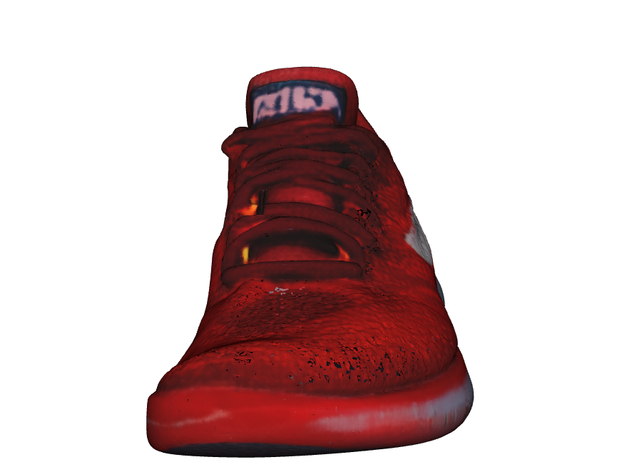
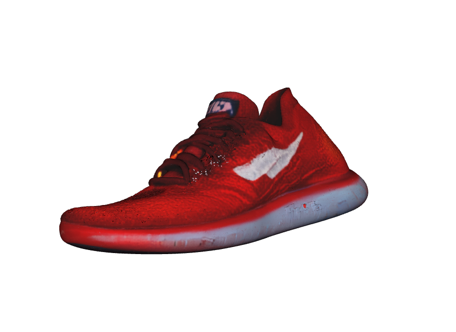
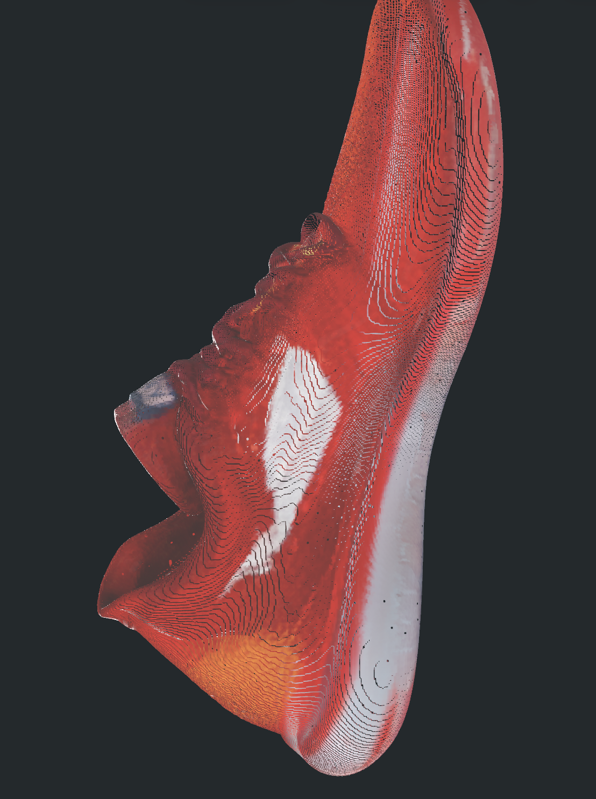

# TRELLIS.2 for Apple Silicon

Run [TRELLIS.2](https://github.com/microsoft/TRELLIS) image-to-3D generation natively on Mac.

This is a port of Microsoft's TRELLIS.2 — a state-of-the-art image-to-3D model — from CUDA-only to Apple Silicon via PyTorch MPS. No NVIDIA GPU required.

## Results

Generates **400K+ vertex meshes with baked PBR textures** from a single image in **~5 minutes 13 seconds on M4 Pro** (24GB, cold start, weights cached, cool machine, pipeline type `512`). About 3m 20s of that is actual generation and baking; the remaining ~1m 45s is pipeline load that happens once per Python process.

Output is a GLB with base-color, metallic, and roughness textures — ready for use in 3D applications.

### Example

**Input image** &rarr; **Generated 3D mesh** (~400K vertices, ~800K triangles) with Metal-baked PBR textures:

<p>




</p>

## Requirements

- macOS on Apple Silicon (M1 or later)
- Python 3.11+
- 24GB+ unified memory recommended (the 4B model is large)
- ~15GB disk space for model weights (downloaded on first run)

## Quick Start

```bash
# Clone this repo
git clone https://github.com/shivampkumar/trellis-mac.git
cd trellis-mac

# (Recommended) Download the Xcode Metal Toolchain so setup can build the
# Metal-accelerated texture baker. Without this, setup falls back to a pure
# Python KDTree baker (slower, slightly lower quality).
xcodebuild -downloadComponent MetalToolchain

# Log into HuggingFace (needed for gated model weights)
hf auth login

# Request access to these gated models (usually instant approval):
#   https://huggingface.co/facebook/dinov3-vitl16-pretrain-lvd1689m
#   https://huggingface.co/briaai/RMBG-2.0

# Run setup (creates venv, installs deps, clones & patches TRELLIS.2,
# builds Metal backends if the toolchain is available)
bash setup.sh

# Activate the environment
source .venv/bin/activate

# Generate a 3D model from an image
python generate.py path/to/image.png
```

To skip the Metal build (for example on older hardware or to speed up setup):

```bash
SKIP_METAL=1 bash setup.sh
```

`setup.sh` now pre-clones Git dependencies into `deps/` so all network I/O happens up front.  
If setup looks inconsistent or you are unsure about local clone state, remove `deps/` and run setup again:

```bash
rm -rf deps
bash setup.sh
```

Output files are saved to the current directory (or use `--output` to specify a path).

## Usage

```bash
# Basic usage
python generate.py photo.png

# With options
python generate.py photo.png --seed 123 --output my_model --pipeline-type 512

# All options
python generate.py --help
```

| Option | Default | Description |
|--------|---------|-------------|
| `--seed` | 42 | Random seed for generation |
| `--output` | `output_3d` | Output filename (without extension) |
| `--pipeline-type` | `512` | Pipeline resolution: `512`, `1024`, `1024_cascade` |
| `--texture-size` | `1024` | PBR texture resolution: `512`, `1024`, `2048` |
| `--no-texture` | — | Skip texture baking, export geometry only |

## What Was Ported

TRELLIS.2 depends on several CUDA-only libraries. This port replaces each of them with a backend that runs on Apple Silicon:

| Original (CUDA) | Replacement | Purpose |
|---|---|---|
| `flex_gemm` | `mtlgemm` (Pedro Naugusto's Metal port) with `backends/conv_none.py` fallback | Sparse 3D convolution. The Metal port is the default now; the pure-PyTorch gather-scatter path is the fallback for machines without the Metal Toolchain. |
| `o_voxel._C` hashmap | `backends/mesh_extract.py` | Mesh extraction from dual voxel grid (pure Python) |
| `flash_attn` | PyTorch SDPA | Scaled dot-product attention for sparse transformers (padded, not fused — room for improvement) |
| `cumesh` | Skipped during decode | Called on meshes large enough to crash the Metal port; replaced with `fast_simplification` before baking |
| `nvdiffrast` | `mtldiffrast` (Metal) with pure-Python fallback | Differentiable rasterization for texture baking |

Additionally, all hardcoded `.cuda()` calls throughout the codebase were patched to use the active device instead.

### Technical Details

**Sparse 3D Convolution** (`backends/conv_none.py`): Implements submanifold sparse convolution by building a spatial hash of active voxels, gathering neighbor features for each kernel position, applying weights via matrix multiplication, and scatter-adding results back. Neighbor maps are cached per-tensor to avoid redundant computation.

**Mesh Extraction** (`backends/mesh_extract.py`): Reimplements `flexible_dual_grid_to_mesh` using Python dictionaries instead of CUDA hashmap operations. Builds a coordinate-to-index lookup table, finds connected voxels for each edge, and triangulates quads using normal alignment heuristics.

**Attention** (patched `full_attn.py`): Adds an SDPA backend to the sparse attention module. Pads variable-length sequences into batches, runs `torch.nn.functional.scaled_dot_product_attention`, then unpads results.

**Texture Baking**: By default we use the Metal stack released by [@pedronaugusto](https://github.com/pedronaugusto) — [`mtldiffrast`](https://github.com/pedronaugusto/mtldiffrast), [`mtlbvh`](https://github.com/pedronaugusto/mtlbvh), [`mtlmesh`](https://github.com/pedronaugusto/mtlmesh), and his CPU fork of [`o_voxel`](https://github.com/pedronaugusto/trellis2-apple) — which exposes `o_voxel.postprocess.to_glb`. We pre-simplify the decoder mesh to ~200K faces with `fast_simplification` before handing it to the Metal BVH (the BVH builder is unstable on 800K+ face inputs). If the Metal toolchain is unavailable, we fall back to `backends/texture_baker.py`: xatlas UV unwrap, then a scipy cKDTree + inverse-distance weighting over the sparse voxel grid at native 512 resolution.

## Performance

Benchmarks on M4 Pro (24GB), pipeline type `512`, full Metal stack installed, weights cached, `SPARSE_CONV_BACKEND=flex_gemm` (default since Pedro Naugusto's zero-copy MPS fix). Numbers below are from a fresh-install end-to-end run (`/usr/bin/time -h python generate.py shoe_input.png`). These assume a **cool machine**. M4 Pro throttles aggressively under sustained load, and I've measured the same run taking 6–10× longer when the CPU had already been pinned for an hour before I started.

| Stage | Time |
|-------|------|
| Pipeline load (first call per process) | 103s |
| Sparse structure sampling (12 steps) | 80s |
| Shape SLat sampling (12 steps) | 22s |
| Texture SLat sampling (12 steps) | 12s |
| Shape SLat decoder (VAE forward) | ~20s |
| Tex SLat decoder (VAE forward) | ~7s |
| `flexible_dual_grid_to_mesh` (pure Python) | ~8s |
| `fast_simplification` (858K → 200K faces) | ~1s |
| Texture bake (Metal, 1024²) | ~15s |
| **Total wall-clock (cold start)** | **5m 13s** |
| Generation + bake only (excluding pipeline load) | 3m 20s |

The shape and texture decoder VAEs got 2.5–2.9× faster after [Pedro Naugusto fixed four bugs in `mtlgemm`](https://github.com/shivampkumar/trellis-mac/issues/1#issuecomment-thread) (zero-copy MPS, real fp16/bf16 kernels, real masked implicit GEMM, no per-call `waitUntilCompleted`). Before his fix, the decoder path was ~38s; now it's ~27s. Sampling steps that also touch sparse conv saw smaller wins — those paths are dominated by attention, which is still SDPA-padded on MPS.

Memory usage peaks at around 18GB unified memory during generation.

First-ever run adds ~15GB of HuggingFace weight downloads (TRELLIS.2, DINOv3, RMBG-2.0) — network-bound, not included above. The pipeline load time is dominated by deserializing those weights from disk; if you batch multiple images in one Python process you pay load once.

With `SKIP_METAL=1` (pure-Python KDTree baker) the texture bake takes ~15s instead of ~11s and coverage near UV chart boundaries is slightly softer. Without the `mtlgemm` Python package specifically, the Metal baker falls back to a `torch.nn.functional.grid_sample` call that can leave mild ring artifacts on curved surfaces; installing `mtlgemm` (done automatically by `setup.sh`) gets rid of them.

## Limitations

- **Hole filling disabled**: Decode-time hole filling requires `cumesh`. The Metal port segfaults on decoder-sized meshes, so we skip this step. Output meshes may have small holes.
- **Sparse attention is not fused**: The SDPA-padded wrapper works but is the single largest remaining bottleneck (~80 s of a 5m 13s run, the sparse structure sampling phase). A fused Metal attention kernel would be a meaningful perf win.
- **Pre-simplified before texture bake**: The mesh is decimated from ~800K to ~200K faces before Metal BVH construction to avoid builder instability. If you need the full-resolution mesh, export it via the OBJ output (which is written before simplification).
- **No training support**: Inference only.

### On `mtlgemm` / `flex_gemm` and thermal throttling

`setup.sh` installs `mtlgemm` as part of the Metal stack. It's used both for the sparse conv diffusion path (since Pedro Naugusto's zero-copy fix) and for the texture baker's `grid_sample_3d`. Without it, `generate.py` falls back to `conv_none.py` for diffusion and monkey-patches `o_voxel.postprocess._grid_sample_3d` with a `torch.nn.functional.grid_sample` call for the bake. The fallback path works but is slower and leaves mild ring artifacts on curved surfaces.

One thing that burned me during testing: after the M4 Pro had been doing heavy compute for a few hours, the same pipeline slowed from ~3.5 min generation to ~36 min purely from thermal throttling — nothing in the code path changed. If you see unusually slow runs, let the machine cool for a few minutes and retry before blaming the code.

## License

The porting code in this repository (backends, patches, scripts) is released under the MIT License.

Upstream model weights are subject to their own licenses:
- **TRELLIS.2**: [MIT License](https://github.com/microsoft/TRELLIS.2/blob/main/LICENSE)
- **DINOv3**: [Meta custom license](https://huggingface.co/facebook/dinov3-vitl16-pretrain-lvd1689m/blob/main/LICENSE.md) (gated, review before commercial use)
- **RMBG-2.0**: [CC BY-NC 4.0](https://huggingface.co/briaai/RMBG-2.0) (non-commercial; commercial use requires a license from BRIA)

## Credits

- [TRELLIS.2](https://github.com/microsoft/TRELLIS.2) by Microsoft Research — the original model and codebase
- [DINOv3](https://github.com/facebookresearch/dinov3) by Meta — image feature extraction
- [RMBG-2.0](https://github.com/Bria-AI/RMBG-2.0) by BRIA AI — background removal
- [@pedronaugusto](https://github.com/pedronaugusto) — `mtldiffrast`, `mtlbvh`, `mtlmesh`, and the CPU fork of `o_voxel` that together provide the Metal texture-baking path used by this repo
